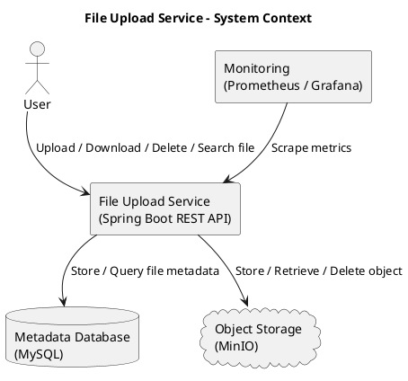

# High Level Design (HLD)

## 1 Document Information

| Item    | Value               |
| ------- | ------------------- |
| Project | File Upload Service |
| Author  | HaiNh               |
| Version | 1.0                 |
| Status  | Draft               |

---

# Overview

Tài liệu này mô tả kiến trúc tổng thể của File Upload Service.

Mục tiêu:

- Mô tả các thành phần chính.
- Mô tả luồng xử lý.
- Giải thích các quyết định thiết kế.
- Làm cơ sở cho LLD.

---

# System Context



---

# Architecture Overview

Các thành phần chính:

- REST API
- Metadata Database
- Object Storage
- Monitoring
- Logging

---

# Component Design

## 1 API Layer

Trách nhiệm:

- Nhận request
- Validate request
- Trả response

---

## 2 Application Layer

Trách nhiệm:

- Điều phối business flow
- Quản lý transaction
- Gọi Object Storage

---

## 3 Metadata Database

Trách nhiệm:

- Lưu metadata
- Search
- Pagination

---

## 4 Object Storage

Trách nhiệm:

- Lưu binary file
- Download object
- Delete object

---

# Upload Flow

```text
Client

↓

Upload API

↓

Validate

↓

Upload Object

↓

Save Metadata

↓

Return Response
```

---

# Download Flow

```text
Client

↓

Find Metadata

↓

Download Object

↓

Return Stream
```

---

# Delete Flow

```text
Client

↓

Find Metadata

↓

Delete Object

↓

Delete Metadata
```

---

# Search Flow

```text
Client

↓

Query Metadata

↓

Return Result
```

---

# Data Storage Strategy

## 1 Metadata

Lưu trong MySQL

Ví dụ:

- file_name
- object_key
- checksum
- size
- owner
- upload_time

---

## 2 Binary File

Lưu trong MinIO.

Không lưu Binary trong MySQL.

---

# Transaction Strategy

Nguyên tắc:

Database Transaction không bao gồm Object Storage.

Upload Flow:

```text
Upload Object

↓

Save Metadata
```

Nếu Upload Object thất bại:

- Không tạo metadata.

Nếu Save Metadata thất bại:

- Xóa object vừa upload (Compensation).

---

# State Management

```text
INIT

↓

UPLOADING

↓

VERIFYING

↓

COMPLETED
```

Chi tiết xem:

[[08-state-machine]]

---

# Error Handling Strategy

Ví dụ:

- Upload timeout
- Network error
- Object Storage unavailable
- Metadata save failed
- Checksum failed

---

# Scalability Design

Thiết kế hướng tới:

- Horizontal Scaling
- Stateless API
- Object Storage mở rộng
- Database tối ưu index

Future:

- Redis
- Kafka
- Elasticsearch

---

# Security Design

- Authentication (Future)
- Authorization
- Presigned URL
- Validate file type
- Validate file size

---

# Backup & Archive Strategy

Backup:

- Backup object định kỳ.
- Backup không xóa object gốc.

Future:

- Archive sang Cold Storage.
- Xóa object active sau khi:
    - Backup thành công.
    - Checksum thành công.
    - Metadata update thành công.

---

# Monitoring

Metrics:

- Upload Count
- Upload Duration
- Download Count
- Error Rate
- Storage Latency

Logging:

- Upload Started
- Upload Completed
- Upload Failed

---

# Deployment Architecture

```text
          Client
             |
          Nginx (Future)
             |
      Spring Boot API
        /          \
       /            \
    MySQL         MinIO
```

---

# Future Architecture

Có thể bổ sung:

- Redis
- Kafka
- Elasticsearch
- Virus Scan
- Thumbnail Service
- CDN
- Audit Log

---

# Design Decisions

| Decision         | Reason              |
| ---------------- | ------------------- |
| MinIO            | Lưu binary file     |
| MySQL            | Lưu metadata        |
| REST API         | Dễ tích hợp         |
| Multipart Upload | Hỗ trợ file lớn     |
| Stateless API    | Scale ngang         |
| Compensation     | Đảm bảo consistency |

---

# Related Documents

- [[03-nfr]]
- [[05-erd]]
- [[06-api-design]]
- [[08-state-machine]]
- [[09-lld]]
