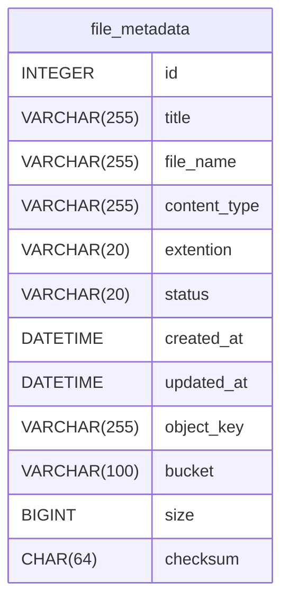

```mermaid
erDiagram
	file_metadata {
		INTEGER id
		VARCHAR(255) title
		VARCHAR(255) file_name
		VARCHAR(255) content_type
		VARCHAR(20) extention
		VARCHAR(20) status
		DATETIME created_at
		DATETIME updated_at
		VARCHAR(255) object_key
		VARCHAR(100) bucket
		BIGINT size
		CHAR(64) checksum
	}
```