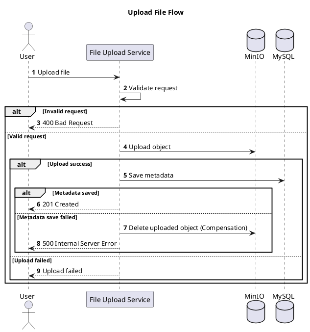

## 1 Upload File 

```plantuml

@startuml  
title Upload File Flow  
  
autonumber  
  
actor User  
  
participant "File Upload Service" as FUS  
database "MinIO" as MinIO  
database "MySQL" as MySQL  
  
User -> FUS: Upload file  
FUS -> FUS: Validate request  
alt Invalid request  
    FUS --> User: 400 Bad Request  
else Valid request  
    FUS -> MinIO: Upload object  
    alt Upload success  
        FUS -> MySQL: Save metadata  
        alt Metadata saved  
            FUS --> User: 201 Created  
        else Metadata save failed  
            FUS -> MinIO: Delete uploaded object (Compensation)  
            FUS --> User: 500 Internal Server Error  
        end  
    else Upload failed  
        FUS --> User: Upload failed  
    end  
end  
  
@enduml
```