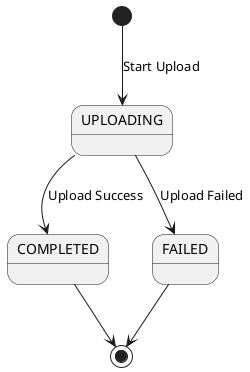

## 1 File upload status

```
UPLOADING
COMPLETED
FAILED
```


| Trạng thái | Ý nghĩa                                                             |
| ---------- | ------------------------------------------------------------------- |
| UPLOADING  | Hệ thống đang nhận dữ liệu từ client.                               |
| COMPLETED  | Upload thành công, object đã được lưu và metadata đã được ghi nhận. |
| FAILED     | Upload thất bại do lỗi mạng, storage hoặc lỗi hệ thống.             |
|            |                                                                     |
## 2 State Transition
