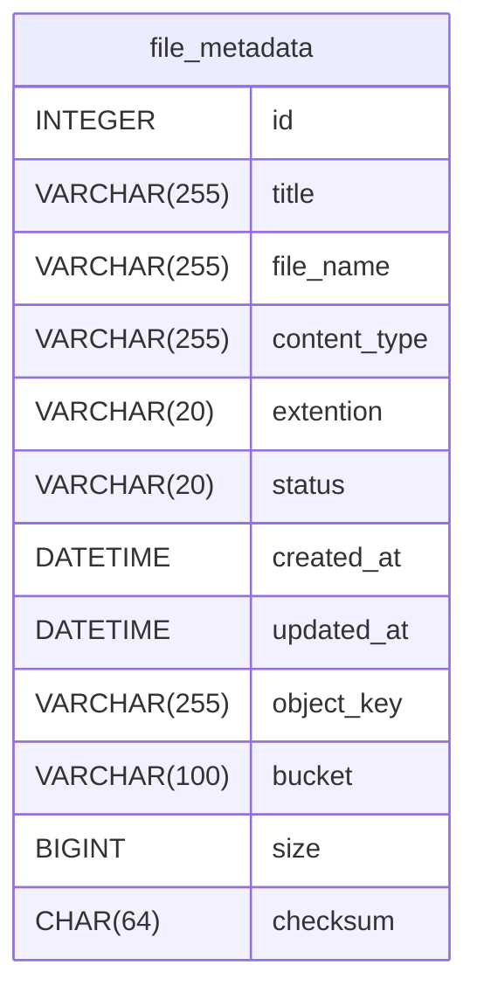
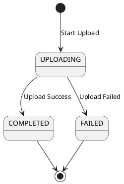
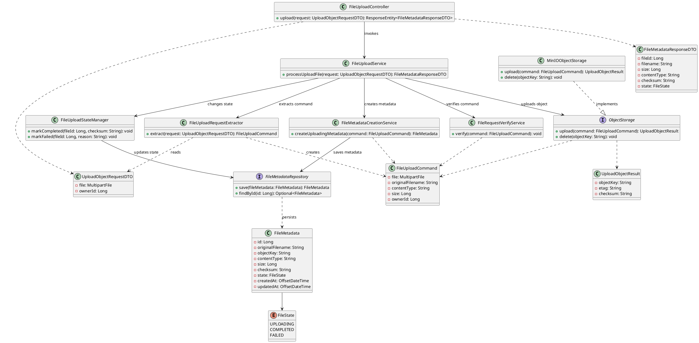
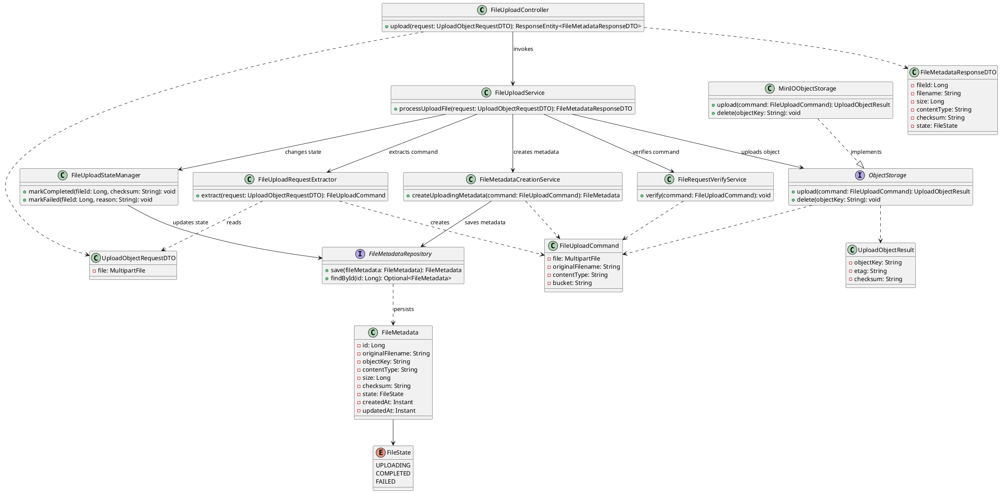

## 1 Document Information

| Item    | Value               |
| ------- | ------------------- |
| Project | File Upload Service |
| Author  | HaiNh               |
| Version | 1.0                 |
| Status  | Draft               |

---
## 2 Overview

Tài liệu này mô tả thiết kế chi tiết (Low-Level Design) của dự án **File Upload Service**, bao gồm các quyết định thiết kế và cách triển khai từng thành phần của hệ thống.

**Mục tiêu của tài liệu:**

- Xác định phạm vi (Scope) và ngoài phạm vi (Non-scope) của hệ thống.

- Mô tả các yêu cầu chức năng (Functional Requirements) của hệ thống.

- Trình bày Domain Model, bao gồm các thực thể và mối quan hệ giữa chúng.

- Mô tả chi tiết thiết kế và cách triển khai của từng tính năng.

- Làm rõ các quyết định thiết kế liên quan đến transaction, concurrency, database, xử lý lỗi và kiểm thử.
## 3 Scope / Non-scope
### 3.1 Scope
- Người dùng có thể upload file lên hệ thống
- Người dùng sẽ chọn file và gửi yêu cầu upload
- Hệ thống kiểm tra File có hợp lệ , hay vượt quá giới hạn...
- Hỗ trợ upload đơn và multipart upload
- Download file
- Delete file
- Quản lý trạng thái upload.
- Phục hồi có file chưa upload xong

### 3.2 Non-scope
- Không quét virus (Virus Scanning).
- Không chuyển đổi định dạng ảnh/video.
- Không resize ảnh.
- Không tích hợp CDN.
- Không hỗ trợ versioning của file.
- Không mã hóa đầu cuối (End-to-End Encryption).
- Không đồng bộ file giữa nhiều cloud provider.
- Không hỗ trợ chia sẻ file qua link public.
- Không có giao diện người dùng (UI).
## 4 Core Requirements

### 4.1 CR-01 Upload File
Hệ thống phải cho phép người dùng upload một file lên Object Storage và lưu metadata vào cơ sở dữ liệu.

### 4.2 CR-02 Download File
Hệ thống phải cho phép tải xuống file thông qua metadata đã lưu.

### 4.3 CR-03 Delete File
Hệ thống phải hỗ trợ xóa file, đồng thời đồng bộ trạng thái giữa Object Storage và cơ sở dữ liệu.

### 4.4 CR-04 Multipart Upload
Hệ thống phải hỗ trợ multipart upload đối với các file có kích thước lớn.

### 4.5 CR-05 Metadata Management
Hệ thống phải quản lý metadata của file, bao gồm tên file, kích thước, content type, checksum, owner và trạng thái.

### 4.6 CR-06 File State Management
Hệ thống phải quản lý vòng đời của file thông qua state machine.

### 4.7 CR-07 Validation
Hệ thống phải kiểm tra các điều kiện hợp lệ trước khi xử lý yêu cầu upload.

### 4.8 CR-08 Recovery
Hệ thống phải có khả năng xử lý hoặc phục hồi các upload chưa hoàn thành.

## 5 Domain Model
### 5.1 Entity Relationship

#### 5.1.1 File Metadata

`File Metadata` lưu trữ các thông tin mô tả của file. Dữ liệu này được sử dụng cho các mục đích sau:

- Hỗ trợ hệ thống xác định vị trí file trong Object Storage để phục vụ download.

- Cung cấp dữ liệu để trả về danh sách file mà người dùng đã upload.

- Quản lý vòng đời của file thông qua trường `state`.

- Kiểm tra tính toàn vẹn của file thông qua `checksum`.


### 5.2 State Machine
Tham khảo chi tiết ở tài liệu [[08-state-machine]]


## 6 Feature: Upload file
### 6.1 Responsibility

- Tính năng này cho phép người dùng upload file chỉ định
- Tính toán checksum trước khi upload
- Lưu File lên object storage / MinIO
- Lưu meta data vào mysql
- So sánh checksum trước và sau khi upload để kiểm tra tính toàn vẹn của file
- Trả url cho người dùng  sau khi upload thành công
### 6.2 API / Entry Point
#### 6.2.1 Endpoint

```http
POST /api/v1/files
```

#### 6.2.2 Content Type

```text
multipart/form-data
```

#### 6.2.3 Request Parts

| Name  | Type   | Required | Description     |
| ----- | ------ | -------- | --------------- |
| file  | File   | Yes      | File cần upload |
| title | String | No       | Tiêu đề file    |

#### 6.2.4 Response

```json
{
  "success": true,
  "data": {
    "id": 1,
    "title": "My document",
    "fileName": "document.pdf",
    "contentType": "application/pdf",
    "extension": "pdf",
    "size": 1048576,
    "checksum": "sha256...",
    "status": "COMPLETED",
    "createdAt": "2026-07-06T10:30:00+07:00"
  },
  "error": null
}
```

#### 6.2.5 Status Codes

| Status | Meaning           |
| ------ | ----------------- |
| 201    | Upload thành công |
| 400    | File không hợp lệ |
| 413    | File quá lớn      |
| 500    | Lỗi hệ thống      |

---
### 6.3 Class Diagram

### 6.4 Sequence Flow

### 6.5 Validation Rules
#### 6.5.1 Upload file Trùng
- phase 1 : cho phép upload file trùng , mỗi lần upload:
    - Tạo một `FileMetadata` mới
    - sinh `ObjectKet` mới
    - Upload object lên MinIO
- Phase sau: thêm một **Phase Deduplication** với checksum và cơ chế tham chiếu nhiều metadata tới cùng một object
### 6.6 Transaction Boundary
### 6.7 Concurrency Control / Locking
#### 6.7.1 mark Completed If Uploading
``` java
@Modifying  
@Query("""  
        update FileMetadata fm        set fm.status = org.mini_lab.file_upload_service.entity.FileState.COMPLETED        where fm.id = :fileId          and fm.status = org.mini_lab.file_upload_service.entity.FileState.UPLOADING        """)  
int markCompletedIfUploading(@Param("fileId") Long fileId);

```

- `markCompletedIfUploading()` sử dụng CAS ở tầng database để đảm bảo transition `UPLOADING -> COMPLETED` chỉ xảy ra khi trạng thái hiện tại vẫn là `UPLOADING`.

- Câu `UPDATE ... WHERE id = :fileId AND status = UPLOADING` sẽ lấy exclusive lock trên row được update. Nếu row đã bị chuyển sang `FAILED`, `COMPLETED` hoặc trạng thái khác, số row affected sẽ bằng `0`.

- Đây là cách bảo vệ state machine trước race condition giữa các luồng như upload success, upload failed, timeout recovery hoặc retry worker.
### 6.8 DB Constraints / Index
### 6.9 Query
### 6.10 Error Handling
### 6.11 Test Cases
#### 6.11.1 `FileMetadataRepository`
##### 6.11.1.1 Case nếu


## 7 Feature:

## 8 Observability
### 8.1 Logging
### 8.2 Metrics
### 8.3 Alerting

## 9 Design Decisions / Trade-offs


