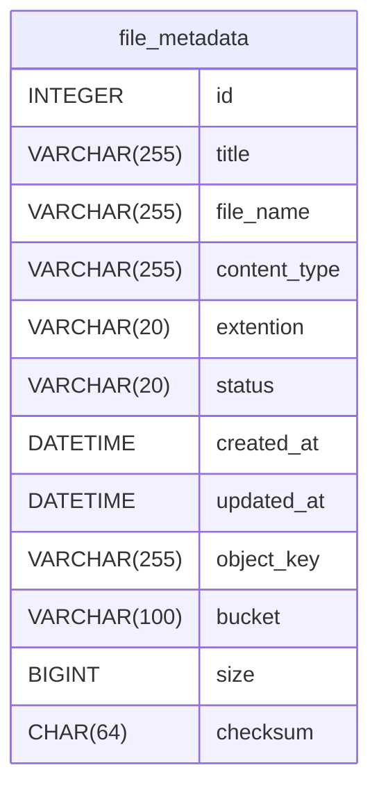
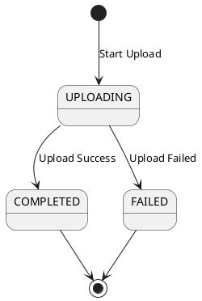
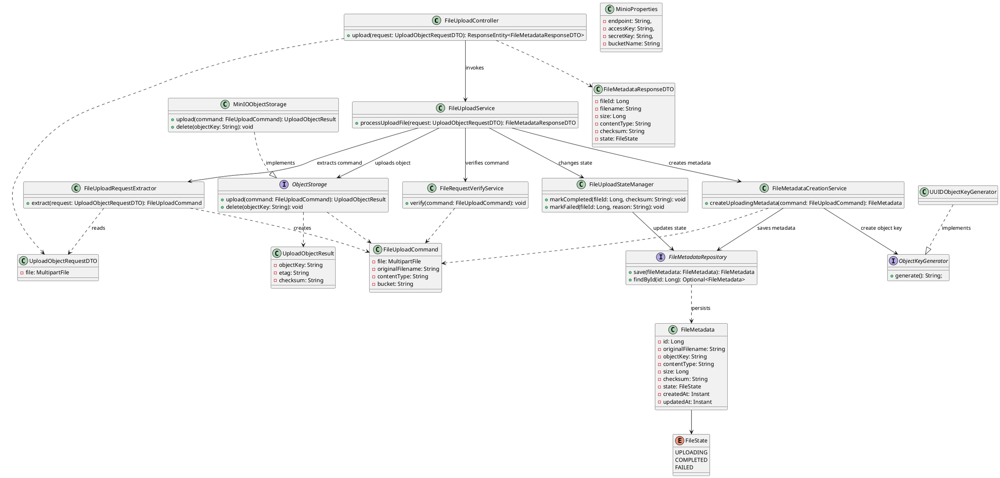
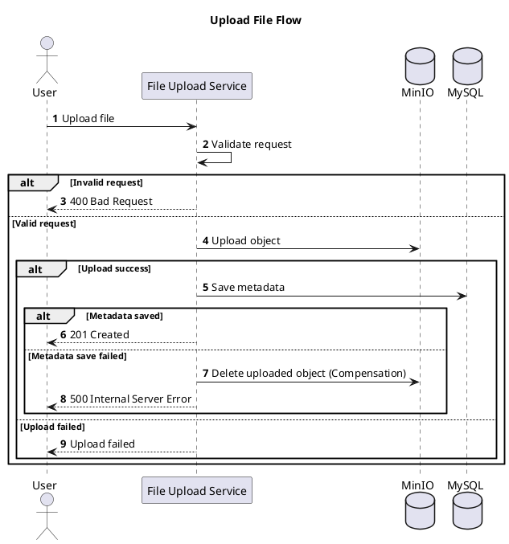
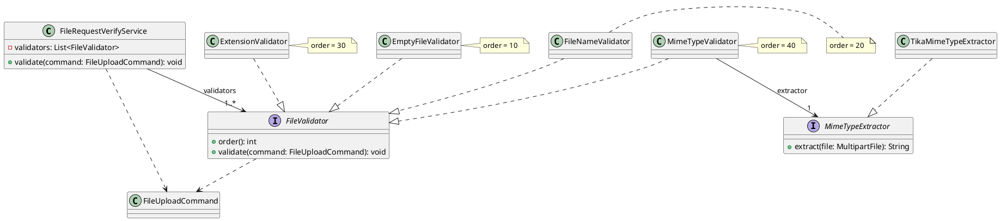
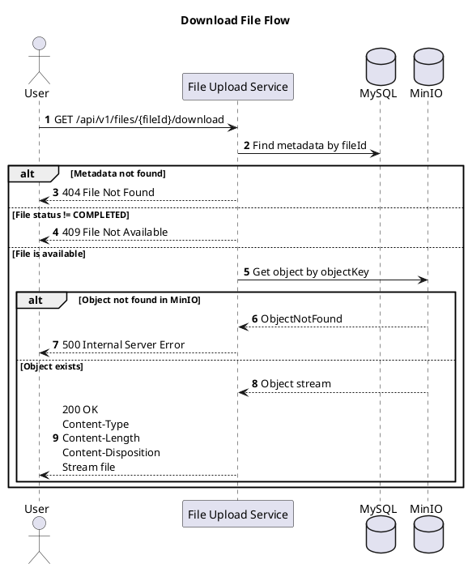
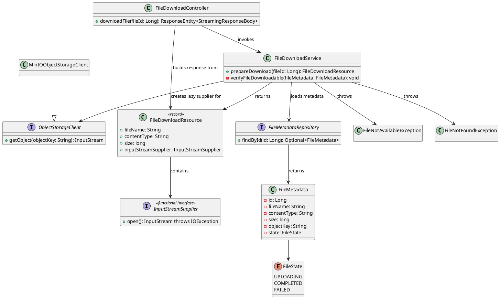

## 1 Document Information

| Item    | Value               |
| ------- | ------------------- |
| Project | File Upload Service |
| Author  | HaiNh               |
| Version | 1.0                 |
| Status  | Draft               |

---
## 2 Overview

Tài liệu này mô tả thiết kế chi tiết (Low-Level Design) của dự án **File Upload Service**, bao gồm các quyết định thiết kế và cách triển khai từng thành phần của hệ thống.

**Mục tiêu của tài liệu:**

- Xác định phạm vi (Scope) và ngoài phạm vi (Non-scope) của hệ thống.

- Mô tả các yêu cầu chức năng (Functional Requirements) của hệ thống.

- Trình bày Domain Model, bao gồm các thực thể và mối quan hệ giữa chúng.

- Mô tả chi tiết thiết kế và cách triển khai của từng tính năng.

- Làm rõ các quyết định thiết kế liên quan đến transaction, concurrency, database, xử lý lỗi và kiểm thử.
## 3 Scope / Non-scope
### 3.1 Scope
- Người dùng có thể upload file lên hệ thống
- Người dùng sẽ chọn file và gửi yêu cầu upload
- Hệ thống kiểm tra File có hợp lệ , hay vượt quá giới hạn...
- Hỗ trợ upload đơn và multipart upload
- Download file
- Delete file
- Quản lý trạng thái upload.
- Phục hồi có file chưa upload xong

### 3.2 Non-scope
- Không quét virus (Virus Scanning).
- Không chuyển đổi định dạng ảnh/video.
- Không resize ảnh.
- Không tích hợp CDN.
- Không hỗ trợ versioning của file.
- Không mã hóa đầu cuối (End-to-End Encryption).
- Không đồng bộ file giữa nhiều cloud provider.
- Không hỗ trợ chia sẻ file qua link public.
- Không có giao diện người dùng (UI).
## 4 Core Requirements

### 4.1 CR-01 Upload File
Hệ thống phải cho phép người dùng upload một file lên Object Storage và lưu metadata vào cơ sở dữ liệu.

### 4.2 CR-02 Download File
Hệ thống phải cho phép tải xuống file thông qua metadata đã lưu.

### 4.3 CR-03 Delete File
Hệ thống phải hỗ trợ xóa file, đồng thời đồng bộ trạng thái giữa Object Storage và cơ sở dữ liệu.

### 4.4 CR-04 Multipart Upload
Hệ thống phải hỗ trợ multipart upload đối với các file có kích thước lớn.

### 4.5 CR-05 Metadata Management
Hệ thống phải quản lý metadata của file, bao gồm tên file, kích thước, content type, checksum, owner và trạng thái.

### 4.6 CR-06 File State Management
Hệ thống phải quản lý vòng đời của file thông qua state machine.

### 4.7 CR-07 Validation
Hệ thống phải kiểm tra các điều kiện hợp lệ trước khi xử lý yêu cầu upload.

### 4.8 CR-08 Recovery
Hệ thống phải có khả năng xử lý hoặc phục hồi các upload chưa hoàn thành.

## 5 Domain Model
### 5.1 Entity Relationship

#### 5.1.1 File Metadata

`File Metadata` lưu trữ các thông tin mô tả của file. Dữ liệu này được sử dụng cho các mục đích sau:

- Hỗ trợ hệ thống xác định vị trí file trong Object Storage để phục vụ download.

- Cung cấp dữ liệu để trả về danh sách file mà người dùng đã upload.

- Quản lý vòng đời của file thông qua trường `state`.

- Kiểm tra tính toàn vẹn của file thông qua `checksum`.


### 5.2 State Machine
Tham khảo chi tiết ở tài liệu [[08-state-machine]]


## 6 Feature: Upload file
### 6.1 Responsibility

- Tính năng này cho phép người dùng upload file chỉ định
- Tính toán checksum trước khi upload
- Lưu File lên object storage / MinIO
- Lưu meta data vào mysql
- So sánh checksum trước và sau khi upload để kiểm tra tính toàn vẹn của file
- Trả url cho người dùng  sau khi upload thành công
### 6.2 API / Entry Point
#### 6.2.1 Endpoint

```http
POST /api/v1/files
```

#### 6.2.2 Content Type

```text
multipart/form-data
```

#### 6.2.3 Request Parts

| Name  | Type   | Required | Description     |
| ----- | ------ | -------- | --------------- |
| file  | File   | Yes      | File cần upload |
| title | String | No       | Tiêu đề file    |

#### 6.2.4 Response

```json
{
  "success": true,
  "data": {
    "id": 1,
    "title": "My document",
    "fileName": "document.pdf",
    "contentType": "application/pdf",
    "extension": "pdf",
    "size": 1048576,
    "checksum": "sha256...",
    "status": "COMPLETED",
    "createdAt": "2026-07-06T10:30:00+07:00"
  },
  "error": null
}
```

#### 6.2.5 Status Codes

| Status | Meaning           |
| ------ | ----------------- |
| 201    | Upload thành công |
| 400    | File không hợp lệ |
| 413    | File quá lớn      |
| 500    | Lỗi hệ thống      |
|        |                   |

---
### 6.3 Class Diagram

### 6.4 Sequence Flow


1. Extract request

2. Validate

3. Tạo metadata trạng thái UPLOADING và commit

4. Upload object ra MinIO

5. Nếu thành công: cập nhật COMPLETED trong transaction mới

6. Nếu thất bại:

  - cố gắng xóa object để compensation

  - cập nhật FAILED trong transaction mới


Luồng hoàn chỉnh
``` java
FileUploadService.processUploadFile(request)
    command = extractor.extract(request)
    verifyService.verify(command)

    metadata =
        metadataCreationService.createUploadingMetadata(command)
        // Transaction 1: INSERT UPLOADING, commit

    try
        objectStorage.upload(
            metadata.objectKey,
            command.inputStream
        )
        // No DB transaction

        stateManager.markCompleted(metadata.id)
        // Transaction 2: UPLOADING -> COMPLETED

    catch uploadException
        try
            objectStorage.delete(metadata.objectKey)
        catch compensationException
            log compensation failure

        stateManager.markFailed(
            metadata.id,
            uploadException
        )
        // Transaction 3: UPLOADING -> FAILED

        throw uploadException
```
### 6.5 Validation Rules
#### 6.5.1 Upload file Trùng
- phase 1 : cho phép upload file trùng , mỗi lần upload:
  - Tạo một `FileMetadata` mới
  - sinh `ObjectKet` mới
  - Upload object lên MinIO
- Phase sau: thêm một **Phase Deduplication** với checksum và cơ chế tham chiếu nhiều metadata tới cùng một object
### 6.6 Transaction Boundary
### 6.7 Concurrency Control / Locking
#### 6.7.1 mark Completed If Uploading
``` java
@Modifying  
@Query("""  
        update FileMetadata fm        set fm.status = org.mini_lab.file_upload_service.entity.FileState.COMPLETED        where fm.id = :fileId          and fm.status = org.mini_lab.file_upload_service.entity.FileState.UPLOADING        """)  
int markCompletedIfUploading(@Param("fileId") Long fileId);

```

- `markCompletedIfUploading()` sử dụng CAS ở tầng database để đảm bảo transition `UPLOADING -> COMPLETED` chỉ xảy ra khi trạng thái hiện tại vẫn là `UPLOADING`.

- Câu `UPDATE ... WHERE id = :fileId AND status = UPLOADING` sẽ lấy exclusive lock trên row được update. Nếu row đã bị chuyển sang `FAILED`, `COMPLETED` hoặc trạng thái khác, số row affected sẽ bằng `0`.

- Đây là cách bảo vệ state machine trước race condition giữa các luồng như upload success, upload failed, timeout recovery hoặc retry worker.

#### 6.7.2 marked failed if uploading

- tương tự như ở  mục `mark completed if uploading`
### 6.8 Object Storage
#### 6.8.1 Bucket
- Bucket: file-upload
- Mỗi object được lưu trong bucket: "file-upload"
#### 6.8.2 Object Key Naming Convention
Object Key được tạo bởi hệ thống.
Format:
$$  files/{yyyy}/{MM}/{uuid} $$
Example:
$$files/2026/07/550e8400-e29b-41d4-a716-446655440000$$
Decision:
- Object Key không sử dụng tên file do người dùng cung cấp.
- Object Key sử dụng UUID để đảm bảo uniqueness.
- Prefix `files/yyyy/MM` chỉ nhằm mục đích tổ chức object theo phân cấp logic (logical hierarchy).
- Không lưu trạng thái (UPLOADING, COMPLETED...) trong Object Key.
- Phase 1 chưa hỗ trợ multi-user nên không đưa userId vào Object Key.
#### 6.8.3 Metadata Mapping
| Metadata         | Nơi lưu    |
| ---------------- | ---------- |
| objectKey        | MinIO + DB |
| originalFilename | DB         |
| contentType      | DB         |
| size             | DB         |
| checksum         | DB         |
### 6.9 File Validation


Khi upload file, hệ thống cần thực hiện nhiều bước kiểm tra khác nhau. Vì vậy, dự án tổ chức quy trình validation theo mô hình **Validation Pipeline**, trong đó mỗi bước kiểm tra được triển khai dưới dạng một **Strategy** thông qua interface `FileValidator`.

`FileRequestVerifyService` đóng vai trò điều phối (orchestrator), lấy danh sách các `FileValidator`, sắp xếp theo `order` và thực thi lần lượt từng validator.

Mỗi validator chỉ chịu trách nhiệm cho một quy tắc kiểm tra cụ thể, chẳng hạn như file rỗng, kích thước file, tên file, extension hoặc MIME type. Nếu một validator phát hiện file không hợp lệ, nó sẽ ném exception và quá trình validation sẽ dừng ngay lập tức.

Các validator được gán thứ tự thực thi thông qua `order`. Thứ tự này được thiết kế dựa trên chi phí xử lý, từ thấp đến cao. Những kiểm tra đơn giản và ít tốn tài nguyên sẽ được thực hiện trước, trong khi các kiểm tra cần đọc hoặc phân tích nội dung file (ví dụ: xác định MIME type bằng Apache Tika) sẽ được thực hiện sau.

Cách thiết kế này giúp hệ thống **fail fast**, tránh thực hiện các bước kiểm tra tốn tài nguyên khi file đã không hợp lệ ở những điều kiện cơ bản. Đồng thời, hệ thống có thể dễ dàng mở rộng bằng cách bổ sung một `FileValidator` mới mà không cần thay đổi luồng validation hiện tại, đảm bảo tuân thủ **Open/Closed Principle (OCP)**.

| Validation                    | Order |
| ----------------------------- | ----- |
| File tồn tại                  | 10    |
| File size                     |       |
| Filename hợp lệ               | 20    |
| MIME type (Apache Tika)       | 40    |
| Magic Number                  |       |
| Extension whitelist           | 30    |
| Generate Object Key           |       |
| Metadata validation           |       |
| Upload exception handling     |       |
| Compensation khi DB/MinIO lỗi |       |
| Logging + RequestId           |       |
### 6.10 File Upload Process
#### 6.10.1 Định nghĩa mệnh đề
Gọi
- E: Extract request thành công
- V: Validate file thành công
- M: Tạo metadata trạng thái `UPLOADING` thành công
- U: Upload object lên MinIO thành công
- C: Cập nhật metadata thành `COMPLETED` thành công
- D: Xóa object compensation thành công
- F: Cập nhật metadata thành `FAILED` thành công
- R: Trả về `FileMetadataResponseDTO`
- I: Ném `InternalServerException`

#### 6.10.2 Upload thành công
Nếu extract, validate, tạo metadata, upload và mark completed đều thành công thì trả về response.
$$
E \land V \land M \land U \land C \rightarrow R
$$
#### 6.10.3 Fail-fast trước khi upload
Extract phải thành công thì mới validate:
$$
E \rightarrow V
$$
Validate thành công thì mới tạo metadata:
$$
E \land V \rightarrow M
$$
Nếu validate thất bại:
$$
\neg V \rightarrow \neg M
$$
Do đó:
$$
\neg V \rightarrow \neg U
$$
và:

$$
\neg V \rightarrow \neg U
$$

### 6.11 DB Constraints / Index

### 6.12 Query
### 6.13 Error Handling

| Case                                                             | message                  | HTTP Status | Exception                     |
| ---------------------------------------------------------------- | ------------------------ | ----------: | ----------------------------- |
| File bị rỗng                                                     | File Empty               |         400 | EmptyFileException            |
| Tên File Không hợp lệ                                            | File name not valid      |         400 | InvalidFilenameException      |
| Đuôi file không hợp lệ                                           | File extension not valid |         400 | InvalidFileExtensionException |
| Mime file không hợp lê                                           | Mime type  not valid     |         400 | InvalidMimeTypeException      |
| đọc stream thất bại                                              |                          |             | FileReadException             |
| Khi tạo metadata nhưng MYSQL không khả dụng                      | Internal Error           |         500 | InternalServerException       |
| Khi upload object thất bại do sự cố mạng                         | Internal Error           |         500 | InternalServerException       |
| Khi upload object thành công nhưng cập nhật `COMPLETED` thất bại | Internal Error           |         500 | InternalServerException       |
### 6.14 Test Cases

#### 6.14.1 Test cases cho `File Upload Service`
##### 6.14.1.1 Tạo metadata thất bại do MySQL không khả dụng
**Given**
- Client gửi request upload file hợp lệ.
- MySQL bị mất kết nối, lag hoặc không thể ghi dữ liệu.

**When**

- Service thực hiện tạo metadata với trạng thái `UPLOADING`.

**Then**
- Việc tạo metadata thất bại.
- Không thực hiện upload object lên S3/MinIO.
- Không có object nào được tạo trong object storage.
- API trả về HTTP `500 Internal Server Error`.

---
##### 6.14.1.2 Upload file và cập nhật trạng thái thành công
**Given**
- Client gửi request upload file hợp lệ.
- Metadata được tạo thành công với trạng thái `UPLOADING`.
- S3/MinIO hoạt động bình thường.
- MySQL hoạt động bình thường.

**When**
- Service upload file lên S3/MinIO.
- Service cập nhật metadata sau khi upload thành công.

**Then**
- Object được lưu thành công trên S3/MinIO.
- Metadata được cập nhật từ `UPLOADING` sang `COMPLETED`.
- `checksum` hoặc thông tin kết quả upload được lưu nếu có.
- API trả về response thành công.

---
##### 6.14.1.3 Upload file thất bại và object chưa được tạo trên S3
**Given**
- Metadata được tạo thành công với trạng thái `UPLOADING`.
- Quá trình upload gặp lỗi do timeout, mất kết nối hoặc lỗi object storage.
- Object chưa được tạo thành công trên S3/MinIO.

**When**

- `objectStorageClient.upload()` ném exception.
  **Then**
- Service thực hiện xử lý lỗi upload.

- Metadata được cập nhật từ `UPLOADING` sang `FAILED`.

- Không tồn tại object trên S3/MinIO.

- API trả về HTTP `500 Internal Server Error`.


---

##### 6.14.1.4 Upload thành công nhưng cập nhật trạng thái `COMPLETED` thất bại

**Given**

- Metadata được tạo thành công với trạng thái `UPLOADING`.

- Object được upload thành công lên S3/MinIO.

- MySQL bị lag, mất kết nối hoặc gặp lỗi khi cập nhật trạng thái `COMPLETED`.


**When**

- `stateManager.markCompleted()` ném exception.


**Then**

- Service thực hiện compensation bằng cách xóa object vừa upload khỏi S3/MinIO.

- Service cố gắng cập nhật metadata từ `UPLOADING` sang `FAILED`.

- Object không còn tồn tại trên S3/MinIO sau khi compensation hoàn thành.

- API trả về HTTP `500 Internal Server Error`.


---

##### 6.14.1.5 Upload thành công nhưng cả cập nhật `COMPLETED` và cập nhật `FAILED` đều thất bại

**Given**

- Object được upload thành công lên S3/MinIO.

- `stateManager.markCompleted()` thất bại do MySQL không khả dụng.

- Việc cập nhật metadata sang `FAILED` cũng thất bại.


**When**

- Service thực hiện xử lý lỗi sau khi `markCompleted()` thất bại.


**Then**

- Service vẫn thực hiện xóa object khỏi S3/MinIO.

- Service có gọi cập nhật trạng thái `FAILED`.

- Exception ban đầu vẫn được giữ làm lỗi chính.

- Exception phát sinh khi cập nhật `FAILED` được log hoặc thêm bằng `addSuppressed()`.

- API trả về HTTP `500 Internal Server Error`.

#### 6.14.2 `FileMetadataRepository`
##### 6.14.2.1 Case nếu


## 7 Feature: Download file
### 7.1 Responsibility
- Tính năng này cho phép người dùng tải file đã upload về máy
- Phía client gửi fileid để hệ thống có thể truy vấn meta data rồi từ đó lấy object key để lấy file từ S3 về
- Không được đọc toàn bộ object bằng byte[], vì file lớn sẽ chiếm heap
- Nên stream trực tiếp từ S3 xuống http response
### 7.2 API / Entry Point
#### 7.2.1 Endpoint

```http
GET /api/v1/files/{fileId}/download
```

#### 7.2.2 Content Type

```text
binary stream
```
#### 7.2.3 Request Parts

| Name   | Type | Required | Description |
| ------ | ---- | -------- | ----------- |
| fileId | Long | Yes      | Id của file |

#### 7.2.4 Response


```text
binary stream
```
#### 7.2.5 Status Codes

| Status | Meaning                          | Exception |
| ------ | -------------------------------- | --------- |
| 200    | Download thành công              |           |
| 404    | Không tìm thấy file              |           |
| 500    | Lỗi hệ thống                     |           |
| 409    | File chưa ở trạng thái COMPLETED |           |


### 7.3 Sequence Flow
Phase 1 :

```
Client -> Spring Boot -> MinIO -> Spring Boot -> Client
```

Kèm theo:

- `StreamingResponseBody`
- `Content-Length`
- `Content-Disposition`
- timeout hợp lý
- xử lý client disconnect
- không update trạng thái file khi download gián đoạn



### 7.4 Class Diagram

Phase 1 sẽ triển khai theo hướng sau:

```
Controller
   → DownloadService: kiểm tra metadata
   → ObjectStorageClient: mở InputStream từ MinIO
   → StreamingResponseBody: copy InputStream sang HTTP OutputStream

```


### 7.5 Validation Rules
### 7.6 Transaction Boundary
### 7.7 Concurrency Control / Locking
### 7.8 DB Constraints / Index
### 7.9 Query
### 7.10 Error Handling
### 7.11 Test Cases
- Client ngắt download
- App đang shutdown
- Mạng tới MinIO lỗi
- HTTP connection bị reset
### 7.12 Trade Off
#### 7.12.1 Streaming file to client
- ở phase 1 sẽ sử dụng `StreamingResponseBody` thường chạy trên **một thread khác do async executor quản lý**, không tiếp tục chiếm servlet request thread ban đầu trong toàn bộ thời gian stream.
- Nhưng backend vẫn chịu
  - một async thread
  - một connection tới mysql
  - một connection tới minio
  - trong suốt lúc file đang được tải, đường truyền mạng của server vẫn bị sử dụng liên tục.
- Phase 2 sẽ sử dụng Presigned url do S3 cung cấp để người dùng có thể tải trực tiếp từ S3 mà không làm backend chịu tải.
## 8 Observability
### 8.1 Logging
### 8.2 Metrics
### 8.3 Alerting

## 9 Design Decisions / Trade-offs


