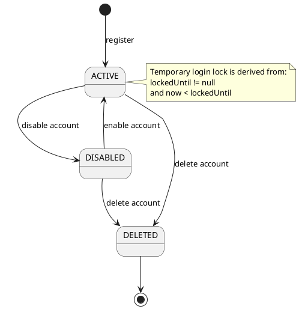
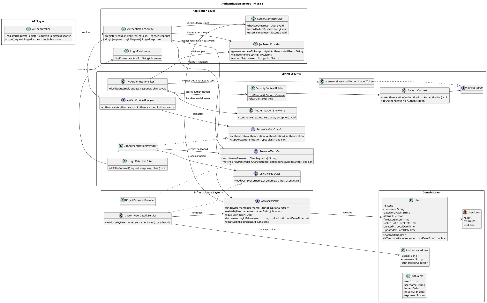
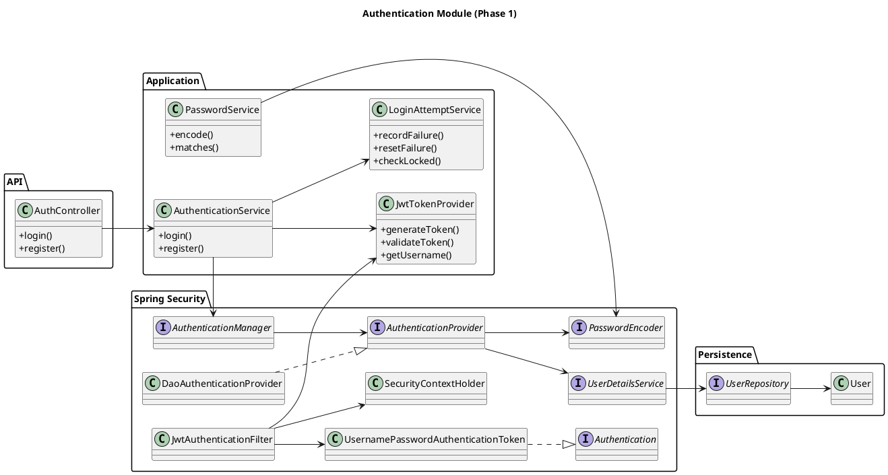
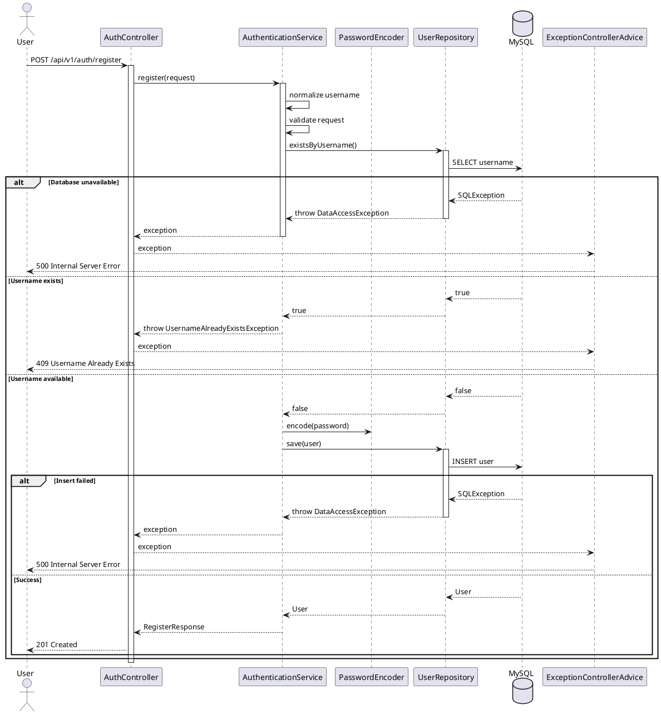

# Authentication Module — Low-Level Design

## 1 Document Information

| Item | Value |
|---|---|
| Project | File Upload Service |
| Module | Authentication |
| Author | HaiNh |
| Version | 1.0 |
| Status | Draft |
| Phase | Phase 1 |

---

## 2 Overview

Tài liệu này mô tả thiết kế chi tiết của **Authentication Module — Phase 1** trong dự án **File Upload Service**.

Phase 1 tập trung vào các thành phần cốt lõi của Spring Security:

- Đăng ký tài khoản bằng username và password.
- Xác thực người dùng bằng username và password.
- Hash mật khẩu trước khi lưu.
- Cấp JWT access token sau khi đăng nhập thành công.
- Xác thực JWT trên các request tới API được bảo vệ.
- Thiết lập `Authentication` vào `SecurityContext`.
- Theo dõi số lần đăng nhập thất bại và khóa tài khoản tạm thời.
- Rate limit login endpoint theo địa chỉ IP.

Phase 1 **không triển khai refresh token, logout phía server, đổi mật khẩu, quản lý phiên hoặc authorization theo role/permission**.

Tài liệu tập trung vào authentication. Việc quyết định người dùng có quyền thao tác trên một file cụ thể hay không thuộc **Authorization Module**.

---

## 3 Scope and Non-scope

### 3.1 Scope

#### 3.1.1 Đăng ký tài khoản

- Người dùng có thể đăng ký bằng username và password.
- Username phải duy nhất trong hệ thống.
- Username được chuẩn hóa về lowercase trước khi lưu và tìm kiếm.
- Password phải đáp ứng chính sách mật khẩu.
- Password phải được hash bằng BCrypt trước khi lưu.
- Sau khi đăng ký thành công, người dùng phải đăng nhập để nhận access token.

#### 3.1.2 Đăng nhập

- Người dùng đăng nhập bằng username và password.
- Hệ thống kiểm tra trạng thái tài khoản trước khi xác thực password.
- Hệ thống từ chối tài khoản bị disable hoặc đang bị khóa tạm thời.
- Khi đăng nhập thành công, hệ thống cấp một JWT access token.
- Đăng nhập thành công reset số lần đăng nhập thất bại liên tiếp.

#### 3.1.3 Quản lý access token

- Access token sử dụng định dạng JWT.
- Access token có thời gian sống 15 phút.
- Hệ thống kiểm tra:
  - Cấu trúc token.
  - Chữ ký.
  - Issuer.
  - Thời gian hết hạn.
  - Các claim bắt buộc.
- Access token hợp lệ được dùng để tạo `Authentication` và lưu vào `SecurityContext`.
- Access token không được lưu trong cơ sở dữ liệu.

#### 3.1.4 Bảo vệ đăng nhập

- Hệ thống theo dõi số lần đăng nhập sai liên tiếp theo tài khoản.
- Sau 5 lần đăng nhập sai liên tiếp, tài khoản bị khóa trong 1 giờ.
- Sau khi hết `lockedUntil`, người dùng có thể đăng nhập lại.
- Đăng nhập thành công reset:
  - `failedLoginCount = 0`.
  - `lockedUntil = null`.
- Login endpoint được rate limit theo địa chỉ IP.
- Phase 1 sử dụng rate limiter trong bộ nhớ vì ứng dụng chỉ chạy một instance.

#### 3.1.5 Xác thực request tới API được bảo vệ

Client gửi access token qua header:

```http
Authorization: Bearer <access-token>
```

- Request không có token, token hết hạn hoặc token không hợp lệ nhận `401 Unauthorized`.
- Request có token hợp lệ được chuyển tiếp tới business layer với danh tính đã được đặt vào `SecurityContext`.
- Việc trả về `403 Forbidden` do không đủ quyền thuộc phạm vi Authorization Module.

### 3.2 Non-scope

- Refresh token.
- Refresh-token rotation và token revocation.
- Logout phía server.
- Quản lý danh sách phiên hoặc thiết bị.
- Đổi mật khẩu.
- Quên mật khẩu và reset mật khẩu qua email.
- OAuth2 Login và OpenID Connect.
- Đăng nhập bằng Google, Facebook, GitHub hoặc identity provider bên ngoài.
- Multi-factor authentication.
- OTP, số điện thoại hoặc sinh trắc học.
- Xác minh email.
- RBAC, permission và resource ownership.
- Rate limiting phân tán bằng Redis.
- Nginx hoặc API Gateway rate limiting.
- Access-token blacklist.

---

## 4 Core Requirements

### 4.1 CR-01 — Đăng ký tài khoản

- Hệ thống phải cho phép đăng ký bằng username và password.
- Username phải được chuẩn hóa về lowercase.
- Username phải duy nhất trong cơ sở dữ liệu.
- Password phải được hash trước khi lưu.
- Hệ thống không được lưu hoặc log plaintext password.

### 4.2 CR-02 — Đăng nhập

- Hệ thống phải xác thực username và password.
- Hệ thống không được tiết lộ username có tồn tại hay không qua thông báo lỗi.
- Hệ thống phải từ chối tài khoản bị disable hoặc đang bị khóa.
- Đăng nhập thành công phải trả về JWT access token.
- Đăng nhập thành công phải reset trạng thái login failure.

### 4.3 CR-03 — Xác thực access token

- Hệ thống phải xác thực chữ ký, issuer và thời hạn của JWT.
- Token không hợp lệ không được tạo `Authentication`.
- Token hợp lệ phải xác định được `userId` và username.
- JWT validation không truy cập database trên mỗi request trong Phase 1.
- `JwtAuthenticationFilter` phải đặt `Authentication` vào `SecurityContext` trước khi request đi vào controller.

### 4.4 CR-04 — Bảo vệ đăng nhập

- Hệ thống phải tăng `failedLoginCount` sau mỗi lần sai password.
- Sau lần sai thứ 5, hệ thống phải thiết lập `lockedUntil = now + 1 hour`.
- Việc tăng failure count phải tránh lost update khi có nhiều request đồng thời.
- Login endpoint phải trả `429 Too Many Requests` khi vượt rate limit.

### 4.5 CR-05 — API được bảo vệ

- Endpoint public không yêu cầu access token.
- Endpoint protected yêu cầu access token hợp lệ.
- Token lỗi hoặc thiếu token trả `401 Unauthorized`.
- Authentication failure phải được xử lý bởi `AuthenticationEntryPoint`.
- `SecurityContext` phải được xóa khi request kết thúc theo cơ chế của Spring Security.

---

## 5 Security Architecture

### 5.1 Authentication Strategy

| Item                   | Decision                       |
| ---------------------- | ------------------------------ |
| Authentication model   | Stateless                      |
| Access token           | JWT                            |
| Password hashing       | BCrypt                         |
| Access-token lifetime  | 15 phút                        |
| JWT issuer             | `file-upload-service`          |
| Transport              | HTTPS                          |
| Access-token transport | `Authorization: Bearer` header |
| HTTP session           | Không sử dụng                  |
| Refresh token          | Không triển khai trong Phase 1 |
| Logout phía server     | Không triển khai trong Phase 1 |
| Rate limiter           | In-memory, theo IP             |
| Account lock           | 5 lần sai, khóa 1 giờ          |
| UserId Format          | UUID v4                        |

### 5.2 Spring Security Request Flow

```text
HTTP Request
    |
DelegatingFilterProxy
    |
FilterChainProxy
    |
SecurityFilterChain
    |
LoginRateLimitFilter
    |
JwtAuthenticationFilter
    |
AuthorizationFilter
    |
DispatcherServlet
    |
Controller
```

Lưu ý:

- `LoginRateLimitFilter` chỉ áp dụng cho `POST /api/v1/auth/login`.
- `JwtAuthenticationFilter` không xử lý username/password login.
- Login endpoint chủ động gọi `AuthenticationManager`.
- `JwtAuthenticationFilter` bỏ qua public endpoints.

### 5.3 Public Endpoints

```text
POST /api/v1/auth/register
POST /api/v1/auth/login
```

### 5.4 Protected Endpoints

```text
/api/v1/files/**
```

---

## 6 Domain Model

### 6.1 User

```text
users
-----
id                   BINARY(16)
username             VARCHAR(100)
password_hash        VARCHAR(255)
status               VARCHAR(30)
failed_login_count   INTEGER
locked_until         DATETIME
created_at           DATETIME
updated_at           DATETIME
```

### 6.2 User Status

```text
ACTIVE
DISABLED
DELETED
```

`LOCKED` không được lưu trong `status`. Trạng thái khóa tạm thời được suy ra từ:

```text
lockedUntil != null && now < lockedUntil
```

### 6.3 User Account State



---

## 7 Class Diagram



### 7.1 Main Components

#### 7.1.1 `AuthenticationService`

- Đăng ký tài khoản.
- Điều phối login.
- Gọi `AuthenticationManager`.
- Reset hoặc ghi nhận login failure.
- Sinh JWT access token.

#### 7.1.2 `JwtTokenProvider`

- Sinh JWT.
- Parse JWT.
- Validate signature, issuer và expiration.
- Trích xuất claim.

#### 7.1.3 `JwtAuthenticationFilter`

- Đọc bearer token.
- Validate token.
- Tạo `Authentication`.
- Ghi `Authentication` vào `SecurityContext`.

#### 7.1.4 `CustomUserDetailsService`

- Tìm user theo username.
- Chuyển `User` thành Spring Security `UserDetails`.

#### 7.1.5 `LoginAttemptService`

- Kiểm tra account có đang bị khóa không.
- Tăng số lần login sai.
- Reset khi login thành công.
- Thiết lập `lockedUntil`.

#### 7.1.6 `LoginRateLimiter`

- Giới hạn request login theo IP.
- Counter được lưu trong memory trong Phase 1.

---

## 8 Feature Designs

### 8.1 Feature F-01 — Register

#### 8.1.1 Responsibility

- Tạo tài khoản mới.
- Chuẩn hóa username.
- Validate username và password.
- Hash password.
- Đảm bảo username duy nhất.

#### 8.1.2 Entry Point

```http
POST /api/v1/auth/register
```

#### 8.1.3 Class Diagram


#### 8.1.4 Sequence Flow



#### 8.1.5 Validation Rules

- Username không null hoặc blank.
- Username dài từ 4 đến 50 ký tự.
- Username chỉ chứa chữ cái, chữ số và dấu gạch dưới.
- Password đáp ứng password policy.
- Username chưa tồn tại.

#### 8.1.6 Transaction Boundary

```text
BEGIN
  Insert user
COMMIT
```

#### 8.1.7 Concurrency

Hai request đăng ký cùng username có thể cùng vượt qua `existsByUsername()`.

Biện pháp bảo vệ cuối cùng:

```text
UNIQUE(username)
```

`existsByUsername()` chỉ giúp trả lỗi sớm, không bảo đảm an toàn khi concurrent.

---

### 8.2 Feature F-02 — Login

#### 8.2.1 Responsibility

- Kiểm tra login rate limit.
- Xác thực username và password.
- Kiểm tra trạng thái tài khoản.
- Ghi nhận login failure hoặc reset failure state.
- Cấp JWT access token.

#### 8.2.2 Entry Point

```http
POST /api/v1/auth/login
```

#### 8.2.3 Sequence Flow

```text
Client
  |
LoginRateLimitFilter
  |
AuthController
  |
AuthenticationService
  |
Load user
  |
Check disabled / deleted / locked
  |
AuthenticationManager.authenticate()
  |
DaoAuthenticationProvider
  |
UserDetailsService + PasswordEncoder
  |
Success?
  ├── Yes -> reset failures -> generate JWT -> return token
  └── No  -> increment failures -> possibly lock -> return 401
```

#### 8.2.4 Transaction Boundary

Login không cần một transaction bao quanh toàn bộ authentication flow.

Các cập nhật database được tách thành transaction ngắn:

```text
Login success:
- Reset failedLoginCount
- Clear lockedUntil

Login failure:
- Increment failedLoginCount atomically
- Set lockedUntil when threshold reached
```

#### 8.2.5 Concurrency

Hai login failure đồng thời có thể gây lost update:

```text
Thread A reads count = 3
Thread B reads count = 3
A writes 4
B writes 4
```

Nên dùng atomic update:

```sql
UPDATE users
SET failed_login_count = failed_login_count + 1,
    locked_until =
        CASE
            WHEN failed_login_count + 1 >= 5
            THEN :lockedUntil
            ELSE locked_until
        END
WHERE id = :userId;
```

---

### 8.3 Feature F-03 — Authenticate Protected Request

#### 8.3.1 Responsibility

- Đọc JWT từ `Authorization` header.
- Xác thực JWT.
- Tạo authenticated principal.
- Đưa `Authentication` vào `SecurityContext`.
- Cho phép request tiếp tục tới controller.

#### 8.3.2 Entry Point

```text
JwtAuthenticationFilter
```

#### 8.3.3 Sequence Flow

```text
HTTP Request
  |
JwtAuthenticationFilter
  |
Extract Authorization header
  |
Validate JWT signature, issuer and expiration
  |
Create UsernamePasswordAuthenticationToken
  |
SecurityContextHolder.getContext().setAuthentication()
  |
Continue filter chain
```

Không có transaction và không truy cập database trong flow này.

---

## 9 Validation Rules

### 9.1 Username

```text
Length: 4–50
Allowed characters: letters, digits, underscore
Normalization: lowercase
Leading/trailing spaces: rejected
```

### 9.2 Password

```text
Length: 8–72 characters
Must contain at least one letter
Must contain at least one digit
Must not equal username
```

BCrypt chỉ xử lý hữu hiệu 72 byte đầu vào, vì vậy Phase 1 giới hạn password tối đa 72 ký tự ASCII hoặc phải validate theo byte length nếu hỗ trợ Unicode đầy đủ.

Không được log password hoặc request body chứa password.

### 9.3 Access Token

- Header phải có định dạng `Bearer <token>`.
- JWT phải có signature hợp lệ.
- `iss` phải bằng `file-upload-service`.
- `sub`, `userId`, `iat`, `exp` phải tồn tại.
- Token phải chưa hết hạn.
- Token rỗng hoặc dài bất thường phải bị từ chối.

---

## 10 Database Design

### 10.1 Users Table

```sql
CREATE TABLE users (
    id BIGINT NOT NULL AUTO_INCREMENT,
    username VARCHAR(100) NOT NULL,
    password_hash VARCHAR(255) NOT NULL,
    status VARCHAR(30) NOT NULL,
    failed_login_count INT NOT NULL DEFAULT 0,
    locked_until DATETIME(6) NULL,
    created_at DATETIME(6) NOT NULL,
    updated_at DATETIME(6) NOT NULL,

    CONSTRAINT pk_users PRIMARY KEY (id),
    CONSTRAINT uk_users_username UNIQUE (username),
    CONSTRAINT chk_users_failed_login_count
        CHECK (failed_login_count >= 0),
    CONSTRAINT chk_users_status
        CHECK (status IN ('ACTIVE', 'DISABLED', 'DELETED'))
);
```

`uk_users_username` đồng thời tạo unique index phục vụ đăng ký và login lookup.

---

## 11 Queries

### 11.1 Find User for Login

```sql
SELECT id,
       username,
       password_hash,
       status,
       failed_login_count,
       locked_until
FROM users
WHERE username = :username;
```

### 11.2 Check Username Exists

```sql
SELECT EXISTS (
    SELECT 1
    FROM users
    WHERE username = :username
);
```

### 11.3 Increment Failed Login Atomically

```sql
UPDATE users
SET failed_login_count = failed_login_count + 1,
    locked_until =
        CASE
            WHEN failed_login_count + 1 >= 5
            THEN :lockedUntil
            ELSE locked_until
        END,
    updated_at = :now
WHERE id = :userId;
```

### 11.4 Reset Failed Login

```sql
UPDATE users
SET failed_login_count = 0,
    locked_until = NULL,
    updated_at = :now
WHERE id = :userId;
```

---

## 12 Failure Matrix

| Step | Failure | Persistent state | Result known? | Retry safe? | Recovery |
|---|---|---|---:|---:|---|
| Register | Username duplicate | Existing user unchanged | Yes | No với cùng username | Return 409 |
| Register | Password validation fails | No change | Yes | Sau khi sửa input | Return 400 |
| Register | DB unavailable | No commit | Usually yes | Yes | Client retry |
| Login | Unknown username | No account state changed | Yes | Yes | Return generic 401 |
| Login | Wrong password | Failure count increased | Yes | Yes | User retries |
| Login | Fifth wrong password | Account temporarily locked | Yes | Không cho đến khi unlock | Wait 1 hour |
| Login | Account disabled | No token created | Yes | No | Admin enables account |
| Login | Account locked | No token created | Yes | No until timeout | Wait |
| Login | Rate limit exceeded | In-memory counter changed | Yes | Later | Return 429 |
| JWT generation | Signing failure | Login failure state already reset có thể xảy ra | Yes | Yes | Return 500, user login lại |
| JWT validation | Missing token | No DB change | Yes | Sau khi cung cấp token | Return 401 |
| JWT validation | Expired token | No DB change | Yes | No | Login again |
| JWT validation | Invalid signature | No DB change | Yes | No | Login again |
| JWT validation | Malformed token | No DB change | Yes | No | Login again |

---

## 13 Error Handling

| Condition | HTTP Status | Error Code |
|---|---:|---|
| Invalid request | 400 | `VALIDATION_ERROR` |
| Invalid username or password | 401 | `INVALID_CREDENTIALS` |
| Missing access token | 401 | `AUTHENTICATION_REQUIRED` |
| Invalid access token | 401 | `INVALID_ACCESS_TOKEN` |
| Expired access token | 401 | `ACCESS_TOKEN_EXPIRED` |
| Account disabled | 403 | `ACCOUNT_DISABLED` |
| Account deleted | 403 | `ACCOUNT_DELETED` |
| Account temporarily locked | 423 | `ACCOUNT_TEMPORARILY_LOCKED` |
| Username already exists | 409 | `USERNAME_ALREADY_EXISTS` |
| Login rate limit exceeded | 429 | `LOGIN_RATE_LIMIT_EXCEEDED` |
| Unexpected server failure | 500 | `INTERNAL_SERVER_ERROR` |

Không phân biệt response giữa:

```text
Username not found
Wrong password
```

Cả hai trả:

```text
Invalid username or password
```

để hạn chế username enumeration.

---

## 14 Security Consistency Strategy

### 14.1 Source of Truth

- User account: bảng `users`.
- Access token validity: JWT signature và claims.
- Temporary account lock: `failed_login_count` và `locked_until`.
- Rate-limit counter: memory của application instance.

### 14.2 Access Token Revocation

Phase 1 không lưu blacklist và không hỗ trợ revoke JWT ngay lập tức.

Một access token đã phát hành tiếp tục hợp lệ cho đến khi hết hạn, ngay cả khi:

- User logout phía client.
- Account bị disable sau khi token đã được cấp.
- Password bị thay đổi ngoài phạm vi Phase 1.

Đây là trade-off được chấp nhận trong Phase 1 để giảm độ phức tạp.

### 14.3 Client Logout

Logout trong Phase 1 chỉ là:

```text
Client xóa access token khỏi nơi lưu trữ
```

Không có logout endpoint phía server.

---

## 15 Concurrency Considerations

| Race condition | Protection |
|---|---|
| Hai register cùng username | Unique constraint |
| Nhiều login failure đồng thời | Atomic database update |
| Login success và login failure đồng thời | Atomic updates; trạng thái cuối có thể phụ thuộc thứ tự commit |
| Nhiều application instances dùng in-memory rate limit | Không được hỗ trợ trong Phase 1 |
| JWT request đồng thời | Stateless, không có shared mutable state |

Với login success và login failure đồng thời trên cùng account, Phase 1 chấp nhận quy tắc **last committed update wins**. Nếu cần semantics chặt hơn, Phase sau có thể dùng optimistic locking hoặc bảng login-attempt riêng.

---

## 16 Threat Model

| Threat | Mitigation |
|---|---|
| Credential brute force | Rate limiting và temporary account lock |
| Username enumeration | Generic login error |
| Password database leak | BCrypt với salt tự sinh |
| JWT tampering | Signature validation |
| Stolen access token | Short expiration và HTTPS |
| SQL injection | Parameterized query/JPA |
| Excessive login traffic | In-memory rate limiting |
| Sensitive-data leakage | Không log password, password hash hoặc raw JWT |
| XSS token theft | Client không nên lưu JWT trong nơi dễ bị JavaScript độc hại truy cập |
| CSRF | Bearer token trong Authorization header; không dùng cookie auth |
| Privilege escalation | Thuộc Authorization Module |

---

## 17 Observability

### 17.1 Logging

Nên log:

```text
requestId
userId nếu đã xác định
maskedUsername hoặc usernameHash
clientIp
userAgent
authenticationResult
failureReason
duration
```

Không log:

```text
rawPassword
passwordHash
rawAccessToken
Authorization header
JWT signing secret
```

### 17.2 Metrics

```text
auth_register_total{result}
auth_login_total{result,reason}
auth_login_duration_seconds
auth_account_lock_total
auth_rate_limit_rejected_total
auth_token_validation_total{result,reason}
```

Không dùng username hoặc userId làm metric label vì gây cardinality cao.

### 17.3 Tracing

Trace các flow:

```text
register
login
protected-request authentication
```

Không ghi raw credential hoặc token vào span attributes.

### 17.4 Alerting

- Login failure rate tăng bất thường.
- Rate-limit rejection tăng mạnh.
- JWT invalid-signature tăng.
- Authentication latency tăng.
- Database errors trong register/login tăng.

---

## 18 Design Decisions and Trade-offs

### 18.1 Chỉ dùng Access Token trong Phase 1

**Ưu điểm**

- Giảm đáng kể độ phức tạp.
- Tập trung học đúng Spring Security authentication flow.
- Không cần refresh-token entity, repository, rotation hoặc CAS.
- Không cần xử lý logout consistency và token replay.

**Đánh đổi**

- Khi access token hết hạn, user phải đăng nhập lại.
- Không revoke access token ngay lập tức.
- Không hỗ trợ quản lý nhiều phiên hoặc nhiều thiết bị.

### 18.2 JWT Access Token

**Ưu điểm**

- Không cần database lookup trên mỗi request.
- Dễ scale horizontally.
- Phù hợp REST API stateless.

**Đánh đổi**

- Không revoke tức thời nếu không có blacklist.
- Thay đổi trạng thái user trong DB không tự động vô hiệu hóa JWT đã phát hành.

**Mitigation**

- Access token sống ngắn: 15 phút.
- Phase sau có thể bổ sung refresh token và token version.

### 18.3 Rate Limiting Phase 1

- Thực hiện trong Spring Boot.
- Giới hạn theo IP.
- Counter lưu in-memory.
- Chỉ chính xác khi chạy một application instance.

Future:

- Chuyển counter sang Redis.
- Bổ sung Nginx, Ingress hoặc API Gateway rate limiting.

### 18.4 Temporary Account Lock

Khóa account theo username chống credential brute force nhưng có thể bị lợi dụng để khóa tài khoản nạn nhân.

Mitigation:

- Kết hợp rate limit theo IP.
- Không tiết lộ số lần đăng nhập còn lại.
- Phase sau có thể áp dụng progressive delay.

---

## 19 Test Cases

### 19.1 Unit Tests

#### 19.1.1 Password

- Hash password.
- Password match thành công.
- Password match thất bại.
- Password policy validation.
- Không chấp nhận password dài vượt giới hạn.

#### 19.1.2 JWT

- Generate valid token.
- Parse valid token.
- Expired token.
- Invalid signature.
- Wrong issuer.
- Missing required claim.
- Malformed token.

#### 19.1.3 Login Attempt

- Increment failure count.
- Lock after fifth failure.
- Reset after success.
- Allow login after lock expires.
- Disabled user remains rejected.

#### 19.1.4 Rate Limiter

- Allow request within limit.
- Reject request over limit.
- Different IPs use independent buckets.
- Bucket resets after configured duration.

### 19.2 Repository Integration Tests

- Unique username constraint.
- Find user by normalized username.
- Atomic failed-login increment.
- Lock time set on fifth failure.
- Reset failed-login state.
- Concurrent registration with same username.

### 19.3 API Integration Tests

#### 19.3.1 Register

- Register success.
- Duplicate username.
- Username normalized to lowercase.
- Invalid username.
- Weak password.
- DB failure.

#### 19.3.2 Login

- Login success.
- Unknown username.
- Wrong password.
- Disabled account.
- Deleted account.
- Temporarily locked account.
- Lock after five failures.
- Failure counter reset after success.
- Login allowed after lock expiration.
- Rate limit exceeded.
- JWT returned with required claims.

#### 19.3.3 Protected API

- Missing access token.
- Valid access token.
- Expired access token.
- Invalid signature.
- Wrong issuer.
- Tampered token.
- Malformed Authorization header.
- Public endpoint works without token.
- Protected endpoint does not reach controller when authentication fails.

### 19.4 Concurrency Tests

- Hai request register cùng username.
- Nhiều login failure đồng thời.
- Login success và login failure đồng thời.
- Nhiều protected requests sử dụng cùng JWT.

### 19.5 Security Tests

- Username enumeration.
- JWT tampering.
- Login brute-force simulation.
- Oversized token input.
- Sensitive-data leakage trong log.
- SQL injection payload.
- XSS payload trong username.
- CSRF không áp dụng cho bearer token header.

---

## 20 Future Phase

Sau khi Phase 1 ổn định, có thể mở rộng:

```text
Phase 2
├── Refresh token
├── Refresh-token rotation
├── Logout endpoint
├── Token revocation
├── Change password
└── Authentication event history

Phase 3
├── Role
├── Permission
├── Resource ownership
└── Method security
```
